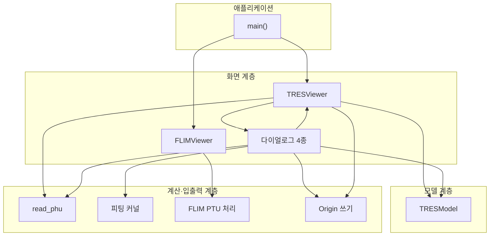
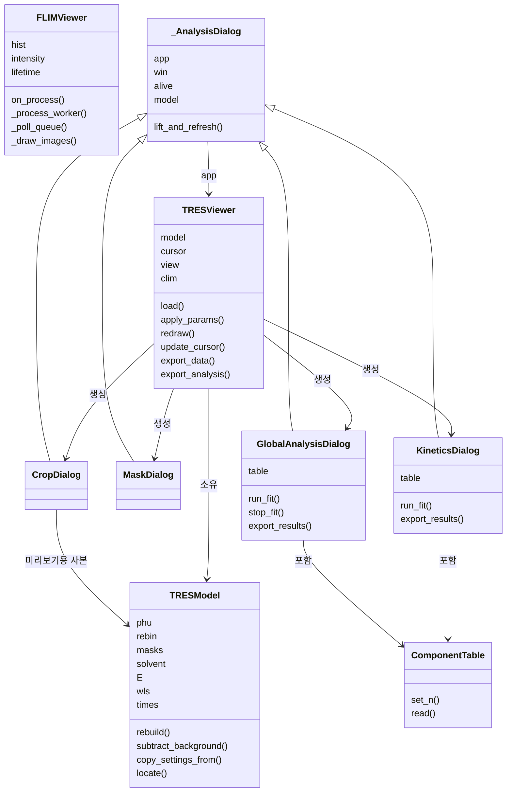
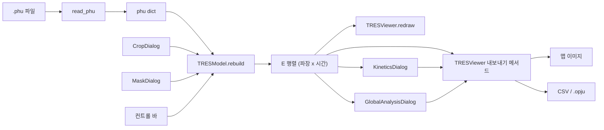
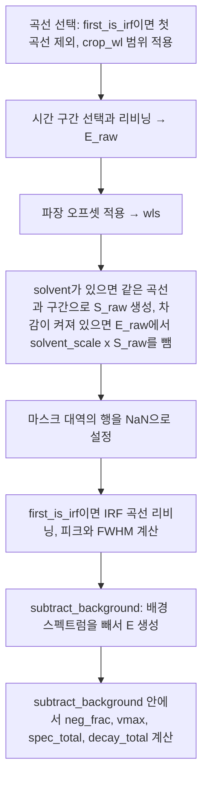
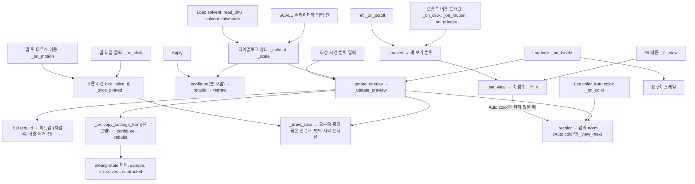
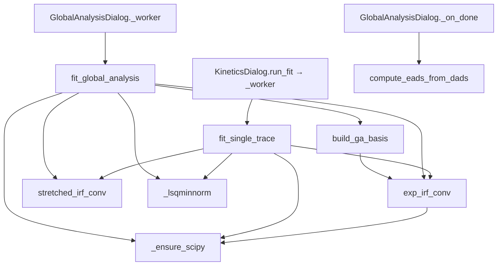
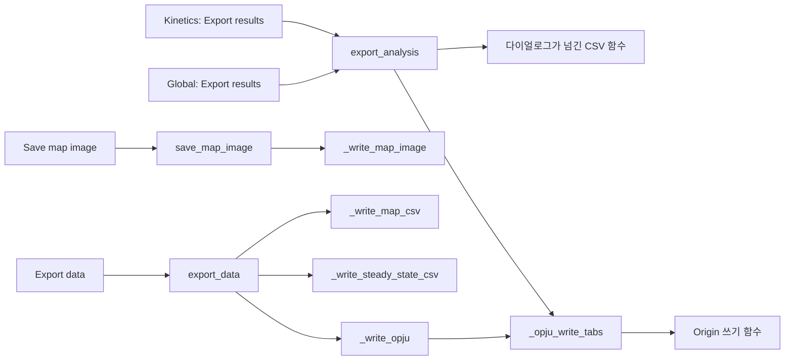
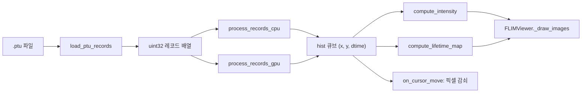
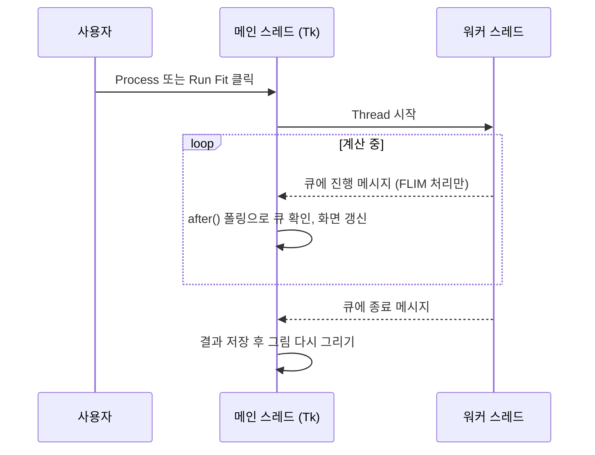

# TCSPC_analysis 아키텍처

TCSPC_analysis는 PicoQuant PicoHarp 300 TCSPC 장비의 측정 파일을 후처리하는 데스크톱 GUI 프로그램이다. Tkinter 창 하나에 서로 독립적인 탭 두 개를 띄운다.

| 탭 | 입력 파일 | 하는 일 |
|---|---|---|
| PHU · TRES | `.phu` (파장별 감쇠 히스토그램) | 시간분해 발광 분광 2D 맵 표시, 전처리, 감쇠 피팅, Global analysis, 내보내기 |
| PTU · FLIM | `.ptu` (T3 TTTR 광자 기록) | 형광수명 이미징: 강도 이미지, 수명 맵, 픽셀별 감쇠 히스토그램 |

이 문서는 프로그램의 구성 요소와 그 사이의 데이터 흐름을 설명한다. 모든 다이어그램 아래에는 같은 내용을 표로 다시 적었다.

- 대상: `tcspc_analysis/` 패키지 (파일 25개, 6,964줄)
- 실행: 프로젝트 폴더에서 `python -m tcspc_analysis [file.phu]`, 또는 같은 일을 하는 스크립트 `run_tcspc_analysis.py`
- GUI: Tkinter(ttk) + matplotlib(TkAgg 백엔드)

## 1. 파일 구성

코드는 패키지 안의 모듈로 나뉘어 있다. 표에서 아래쪽 모듈이 위쪽 모듈을 사용한다.

| 모듈 | 줄 수 | 내용 | 주요 이름 |
|---|---|---|---|
| `__init__.py` | 153 | 프로그램 설명(모듈 docstring), matplotlib 백엔드 선택 | — |
| `__main__.py` | 5 | `python -m tcspc_analysis`로 실행할 때의 시작점 | — |
| `version.py` | 2 | 버전 문자열 | `APP_VERSION` |
| `paths.py` | 37 | 프로그램이 놓인 폴더(exe의 폴더, 또는 패키지의 부모 폴더)와 프로그램이 스스로 쓰는 폴더 찾기 | `program_dir`, `user_dir` |
| `phu.py` | 167 | `.phu` 리더: PQHISTO 태그 헤더와 히스토그램 블록 파싱 | `read_phu` |
| `util.py` | 77 | 헬퍼: 파장 → RGB 변환, 피크/FWHM 계산 | `wavelength_to_rgb`, `fwhm_of`, `short_name` |
| `origin.py` | 102 | Origin 쓰기: 워크북·워크시트 찾기와 채우기 | `_origin_book1`, `_origin_sheet`, `_origin_fill_tres`, `_origin_fill_steady`, `_origin_fill_table` |
| `fitting.py` | 778 | 피팅 커널: IRF 컨볼루션 지수 모델, 단일 곡선 피팅, 전역 피팅, EADS 변환 | `exp_irf_conv`, `stretched_irf_conv`, `build_ga_basis`, `fit_single_trace`, `fit_global_analysis`, `compute_eads_from_dads` |
| `model.py` | 356 | 모델: TRES 데이터의 리비닝, 자르기, solvent 차감, 마스크, 배경 제거. solvent 파일 호환성 검사, 지도의 파장 축 배치 | `TRESModel`, `solvent_mismatch`, `wavelength_grid` |
| `theme.py` | 162 | 색상 상수, ttk 테마, 그림 축 꾸미기 | `apply_theme`, `shade_wl_masks`, `style_plot_ax`, `preview_norm_cmap` |
| `flim.py` | 559 | FLIM PTU 처리(T3 레코드 읽기, 픽셀별 감쇠 큐브, 이미지 계산, GPU 감지)와 FLIM 탭 화면 | `load_ptu_records`, `process_records_cpu`, `process_records_gpu`, `compute_intensity`, `compute_lifetime_map`, `detect_gpu`, `start_gpu_detection`, `FLIMViewer` |
| `dialogs/__init__.py` | 0 | (비어 있음) | — |
| `dialogs/common.py` | 512 | 팝업 창의 공통 기반, 두 피팅 창의 공통 기반, 성분 표 위젯, 피팅 결과 CSV 쓰기 | `ComponentTable`, `_AnalysisDialog`, `_FitDialog`, `write_fit_csv` |
| `dialogs/crop_view.py` | 155 | Crop 창의 일부: 지도의 확대·이동, 색 척도, 시간 척도 | `_CropView` |
| `dialogs/crop_slice.py` | 85 | Crop 창의 일부: 마우스 위치의 시각별 스펙트럼(보관한 그림 위에 얹어 그림) | `_CropSlice` |
| `dialogs/crop_solvent.py` | 109 | Crop 창의 일부: solvent 파일과 scale | `_CropSolvent` |
| `dialogs/crop.py` | 614 | Crop 창 (범위 선택, solvent 차감 미리보기, Apply). 위 세 모듈의 클래스를 물려받음 | `CropDialog` |
| `dialogs/mask.py` | 160 | Mask 창 | `MaskDialog` |
| `dialogs/kinetics.py` | 411 | Kinetics 창 | `KineticsDialog` |
| `dialogs/global_analysis.py` | 520 | Global analysis 창 | `GlobalAnalysisDialog` |
| `viewer_figure.py` | 528 | TRES 탭의 일부: 그림(지도, decay, spectrum, steady state, 컬러바)을 그리는 일과 마우스 조작(커서, 고정, 확대 사각형) | `_MapFigure` |
| `viewer_export.py` | 611 | TRES 탭의 일부: 지도 그림, 지도·steady-state CSV, Origin 프로젝트 쓰기, 피팅 창의 내보내기가 거치는 경로 | `_Export`, `CSV_NUMBER` |
| `viewer.py` | 561 | TRES 탭: 설정 줄, 파일 열기, 설정 적용, 팝업 창 관리. 위 두 모듈의 클래스를 물려받음 | `TRESViewer` |
| `freezelog.py` | 216 | 멈춤 기록 | `FreezeLog` |
| `app.py` | 84 | 창과 탭을 만들고 이벤트 루프 시작 | `main` |

모듈 사이의 import는 모두 `from .phu import read_phu`처럼 이름을 직접 가져오는 형식이고, 방향은 아래 표에 있는 것뿐이다.

| 모듈 | 가져다 쓰는 모듈 |
|---|---|
| `version.py`, `paths.py`, `phu.py`, `util.py`, `origin.py`, `fitting.py`, `theme.py` | (패키지의 다른 모듈을 쓰지 않음) |
| `model.py` | `util.py` |
| `flim.py` | `theme.py` |
| `dialogs/common.py` | `fitting.py`, `theme.py` |
| `dialogs/crop_view.py` | `theme.py` |
| `dialogs/crop_slice.py` | `theme.py` |
| `dialogs/crop_solvent.py` | `phu.py`, `util.py`, `model.py` |
| `dialogs/crop.py` | `model.py`, `theme.py`, `dialogs/common.py`, `dialogs/crop_view.py`, `dialogs/crop_slice.py`, `dialogs/crop_solvent.py` |
| `dialogs/mask.py` | `theme.py`, `dialogs/common.py` |
| `dialogs/kinetics.py` | `origin.py`, `fitting.py`, `theme.py`, `dialogs/common.py` |
| `dialogs/global_analysis.py` | `origin.py`, `fitting.py`, `model.py`, `theme.py`, `dialogs/common.py` |
| `viewer_figure.py` | `util.py`, `theme.py` |
| `viewer_export.py` | `paths.py`, `origin.py`, `model.py`, `theme.py` |
| `viewer.py` | `phu.py`, `util.py`, `model.py`, `theme.py`, `viewer_figure.py`, `viewer_export.py`, `dialogs/crop.py`, `dialogs/mask.py`, `dialogs/kinetics.py`, `dialogs/global_analysis.py` |
| `freezelog.py` | `version.py`, `paths.py` |
| `app.py` | `version.py`, `paths.py`, `theme.py`, `flim.py`, `viewer.py`, `freezelog.py` |

패키지 밖에는 실행 스크립트 `run_tcspc_analysis.py`가 있다. `main`을 부르는 것이 전부이며, 런처(`TCSPC_analysis.bat`)와 exe 빌드가 이 파일에서 시작한다. 1.4까지의 버전은 버전마다 파일 하나(`TCSPC_analysis_1.0ver.py` ~ `TCSPC_analysis_1.4ver.py`)로 저장소에 그대로 남아 있고, 이 패키지는 1.4.2의 코드를 내용 변경 없이 모듈로 나눈 것이다(`tools/split_1_4.py`).

## 2. 계층 구조

프로그램은 네 계층으로 나뉜다. 계산·입출력 계층의 함수들은 Tk 위젯을 참조하지 않고, 화면 계층이 이들을 호출한다. 모델은 `read_phu`를 직접 부르지 않고 `TRESViewer`가 읽어 넘겨준 dict를 받는다.

| 계층 | 구성 요소 | 책임 | 사용하는 대상 |
|---|---|---|---|
| 애플리케이션 | `main`, `FreezeLog` | Tk 창, 테마, 탭 두 개 생성. 주 루프가 멈춘 위치와 콜백 예외를 로그 파일에 기록 | `TRESViewer`, `FLIMViewer`, `apply_theme` |
| 화면 | `TRESViewer` | TRES 탭의 위젯, 그림, 마우스 이벤트, 내보내기 | `TRESModel`, `read_phu`, Origin 쓰기 함수, 다이얼로그 |
| 화면 | `FLIMViewer` | FLIM 탭의 위젯, 그림, 워커 스레드 관리 | FLIM PTU 처리 함수 |
| 화면 | `CropDialog`, `MaskDialog`, `KineticsDialog`, `GlobalAnalysisDialog` | 전처리·분석 팝업 창 | `TRESModel`, 피팅 커널, `read_phu`와 `solvent_mismatch`(solvent 파일 열기), `TRESViewer`의 `redraw`와 내보내기 메서드, Origin 쓰기 함수(`_origin_fill_table`) |
| 모델 | `TRESModel` | 원본 배열에서 표시용 행렬을 만들어 모든 패널에 제공 | `read_phu`가 돌려준 dict, `fwhm_of` |
| 계산·입출력 | `read_phu`, 피팅 커널, FLIM PTU 처리, Origin 쓰기 | 파일 파싱, 수치 계산, 외부 프로그램 출력 | numpy, scipy, tensorflow, originpro |

두 탭은 코드를 공유하지 않는다. 공통으로 쓰는 것은 색상 상수(`BG`, `PANEL`, `INK`, `ACCENT` 등)와 `apply_theme`가 설정한 ttk 스타일뿐이다.

## 3. 클래스 관계

| 클래스 | 상속 | 역할 | 관계 |
|---|---|---|---|
| `TRESModel` | 없음 | `.phu` dict와 처리 설정을 보관하고 표시용 행렬 `E`를 계산 | `TRESViewer`가 하나를 소유. `CropDialog`가 미리보기용으로 둘을 더 만듦 |
| `TRESViewer` | 없음 | TRES 탭 전체. 모델을 만들고 설정을 바꾸며 그림을 다시 그림 | 다이얼로그 네 종류를 종류별로 최대 하나씩 띄움 |
| `FLIMViewer` | 없음 | FLIM 탭 전체 | 다른 클래스와 관계 없음 |
| `_AnalysisDialog` | 없음 | 팝업 창의 공통 기반. `Toplevel` 생성, 열림 상태(`alive`) 추적, `app.model` 접근 제공 | `app` 속성으로 `TRESViewer`를 참조 |
| `CropDialog` | `_AnalysisDialog` | 파장·시간 사각 영역 선택, solvent 파일 불러오기와 차감 비율 조절 | 모델의 `crop_wl`, `t_min_ps`, `t_max_ps`, `solvent`, `solvent_scale`, `solvent_sub`를 설정 |
| `MaskDialog` | `_AnalysisDialog` | 제외할 파장 대역 추가·삭제 | 모델의 `masks`를 설정 |
| `KineticsDialog` | `_AnalysisDialog` | 한 파장의 감쇠 피팅 | 워커 스레드에서 `fit_single_trace` 호출 |
| `GlobalAnalysisDialog` | `_AnalysisDialog` | 맵 전체의 전역 피팅 | `fit_global_analysis`, `compute_eads_from_dads` 호출 |
| `ComponentTable` | `ttk.Frame` | 성분별 τ 초기값, 고정 여부, stretched 여부, β를 입력받는 표 위젯 | 두 피팅 다이얼로그가 하나씩 포함 |

다이얼로그는 측정 데이터를 `_AnalysisDialog.model` 프로퍼티로 읽는다. 이 프로퍼티가 `app.model`을 돌려주므로 항상 현재 로드된 파일의 모델을 본다. 다이얼로그가 직접 보관하는 것은 작업용 상태뿐이다: `CropDialog`의 미리보기 모델 둘(히트맵용 `_full`, steady-state용 `_pv`)과 아직 반영하지 않은 solvent와 비율(`_solvent`, `_scale`), 시각별 스펙트럼용 원시 카운트(`_raw0`)와 고른 시간 bin(`_slice_ti`, `_slice_pinned`), 맵을 보는 방식(`var_zlog`, `var_auto`, `var_tlog`, 드래그 중인 `_pan`), 두 피팅 다이얼로그의 마지막 피팅 결과(`_last`), `GlobalAnalysisDialog`가 피팅에 넘긴 데이터 사본(`_fit_D`, `_fit_t`, `_fit_wls`).

## 4. TRES 탭 파이프라인

### 4.1 데이터 흐름

| 단계 | 담당 | 입력 | 출력 |
|---|---|---|---|
| 파일 읽기 | `read_phu` | `.phu` 경로 | dict: `counts`(곡선 x bin), `wls`, `res_ps`, `nbins`, `ncurves`와 장비 메타데이터 |
| 모델 생성 | `TRESViewer.load` | phu dict, 컨트롤 바의 현재 값 | `TRESModel` 인스턴스 |
| 모델 재구성 | `TRESModel.rebuild` | phu dict + 처리 설정 (+ solvent의 phu dict) | `E_raw`, `S_raw`, `wls`, IRF 정보, 이어서 `subtract_background` 호출 |
| 배경 제거와 요약 | `TRESModel.subtract_background` | `E_raw`, 배경 구간 | `E`, `bg_spec`, `neg_frac`, `vmax`, `spec_total`, `decay_total` |
| 화면 그리기 | `TRESViewer.redraw`, `update_cursor` | `E`와 요약 배열 | 2D 맵, 감쇠, 스펙트럼, 정상상태 스펙트럼 |
| 전처리 | `CropDialog`, `MaskDialog` | 사용자 입력 | 모델 설정 변경 후 `rebuild`와 `redraw` |
| 분석 | `KineticsDialog`, `GlobalAnalysisDialog` | `E`, `times`, `wls` | 피팅 결과 dict |
| 내보내기 | `TRESViewer`의 내보내기 메서드 | `E`, 요약 배열, 피팅 결과 | PNG/PDF/SVG, CSV, `.opju` |

### 4.2 TRESModel

모델은 원본 `phu` dict를 변경하지 않는다. 설정이 바뀔 때마다 `rebuild`가 원본에서 파생 배열을 처음부터 다시 만든다.

| 구분 | 속성 | 의미 |
|---|---|---|
| 설정 | `rebin` | 합칠 시간 bin 개수 |
| 설정 | `t_min_ps`, `t_max_ps` | 사용할 시간 구간 |
| 설정 | `first_is_irf` | 첫 곡선을 IRF로 취급할지 여부 |
| 설정 | `t0_align` | 시간 원점을 IRF 피크에 맞출지 여부 |
| 설정 | `bg_sub`, `bg_lo_ps`, `bg_hi_ps` | 배경 제거 여부와 배경 구간 |
| 설정 | `wl_offset` | 파장 축 이동량(nm) |
| 설정 | `crop_wl`, `masks` | 파장 자르기 범위, 마스크 대역 목록 |
| 설정 | `solvent`, `solvent_scale`, `solvent_sub` | solvent 측정의 phu dict, 차감 비율, 차감 사용 여부 |
| 파생 | `E_raw`, `E` | 배경 제거 전·후의 (파장 x 시간) 행렬. solvent 차감이 켜져 있으면 차감이 반영된 값 |
| 파생 | `S_raw` | 샘플과 같은 곡선·구간·리비닝으로 자른 solvent 행렬 (비율을 곱하기 전). solvent가 없으면 `None` |
| 파생 | `neg_frac` | 0보다 작은 bin의 비율 (solvent 차감 뒤의 음수는 자르지 않고 둠) |
| 파생 | `wls`, `n_w`, `n_t`, `t_off_ps` | 축 정보 |
| 파생 | `irf`, `irf_wl`, `irf_peak_ps`, `irf_fwhm_ps` | IRF 곡선과 그 피크, 폭 |
| 파생 | `bg_spec`, `bg_window_ps`, `neg_frac`, `vmax` | 배경 스펙트럼과 색상 범위 정보 |
| 파생 | `spec_total`, `decay_total` | 시간 합산 스펙트럼, 파장 합산 감쇠 |
| 프로퍼티 | `times`, `t_lo`, `t_hi`, `dt_ps`, `t0`, `wl_edges`, `t_full_ps`, `t_data_ps` | 축과 범위 계산 |
| 프로퍼티 | `solvent_active` | solvent가 있고 차감이 켜져 있는지 |
| 메서드 | `decay_at`, `spectrum_at`, `locate` | 한 파장의 감쇠, 한 시각의 스펙트럼, 좌표 → 인덱스 변환 |
| 메서드 | `copy_settings_from` | 다른 모델의 설정을 모두 복사. 복사할 설정 이름은 클래스 상수 `SETTINGS`에 모여 있음 |
| 메서드 | `solvent_spectrum` | 샘플과 같은 방식(배경 구간 평균 제거, 시간 합산)으로 계산한 solvent의 정상상태 스펙트럼 (비율을 곱하기 전) |

`rebuild`의 처리 순서는 다음과 같다.

| 순서 | 처리 | 결과 |
|---|---|---|
| 1 | `first_is_irf`가 켜져 있으면 첫 곡선을 빼고, `crop_wl` 범위 안의 곡선만 선택 | 사용할 곡선 인덱스 |
| 2 | `t_min_ps`~`t_max_ps` 구간을 `rebin` 단위로 합산 | `E_raw`, `t_off_ps` |
| 3 | 파일의 파장에 `wl_offset`을 더함 | `wls` |
| 4 | `solvent`가 있으면 그 `counts`를 1, 2단계와 같은 곡선·구간·`rebin`으로 잘라 합산. `solvent_sub`가 켜져 있으면 `E_raw`에서 `solvent_scale` × `S_raw`를 뺌 | `S_raw`, 차감된 `E_raw` |
| 5 | `masks`에 해당하는 행을 NaN으로 설정 (`E_raw`와 `S_raw` 모두) | `mask_rows` |
| 6 | `first_is_irf`가 켜져 있으면 샘플의 IRF 곡선을 같은 구간으로 리비닝하고 `fwhm_of`로 피크와 폭 계산 | `irf`, `irf_peak_ps`, `irf_fwhm_ps` |
| 7 | `subtract_background` 호출: 배경 구간의 평균 스펙트럼을 모든 시간 bin에서 뺌 | `E`, `bg_spec` |
| 8 | `subtract_background` 안에서 음수 bin의 비율, 색상 범위, 합산 배열 계산. solvent 차감 뒤에 남은 음수는 자르지 않음(1.5까지는 0으로 잘랐음) | `neg_frac`, `vmax`, `spec_total`, `decay_total` |

`TRESViewer._set_bg_window`는 배경 구간을 옮길 때 `rebuild` 없이 7~8단계(`subtract_background`)만 다시 실행한다.

solvent 차감은 4단계에서만 일어난다. solvent의 곡선은 샘플과 같은 인덱스로 고르므로 두 파일의 격자가 같아야 하며, 이 조건은 파일을 열 때 `solvent_mismatch`가 검사한다. `solvent`가 없거나 `solvent_sub`가 꺼져 있으면 4단계의 뺄셈은 실행되지 않는다.

### 4.3 TRESViewer

화면은 파일 바, 컨트롤 바 세 줄, matplotlib 그림 하나로 구성된다. 컨트롤 바의 셋째 줄에는 solvent 차감을 켜고 끄는 Subtract solvent 체크박스와 현재 비율·파일 이름·잘린 bin 비율을 보여 주는 라벨이 있다. 그림은 `GridSpec` 3x3으로 여섯 축을 배치한다.

| 축 | 내용 | 공유 축 |
|---|---|---|
| `ax_map` | TRES 2D 맵 (x: 파장, y: 시간) | 기준 |
| `ax_hist` | 커서 파장의 감쇠 곡선, IRF | y축을 맵과 공유 |
| `ax_spec` | 커서 시각의 스펙트럼 | x축을 맵과 공유 |
| `ax_ss` | 정상상태 스펙트럼 (`spec_total`) | 없음 |
| `ax_rib` | 파장 색상 띠 | x축을 맵과 공유 |
| `cax` | 컬러바 | 없음 |

그리기는 두 경로로 나뉜다.

| 경로 | 메서드 | 실행 시점 | 방식 |
|---|---|---|---|
| 전체 다시 그리기 | `redraw` | 파일 로드, 설정 변경, 확대, 대비 변경 | `_sync_solvent_ui`로 solvent 체크박스와 라벨을 모델에 맞춘 뒤 모든 축을 지우고 새로 그림 |
| 커서 갱신 | `update_cursor` | 마우스 이동, 고정/해제 | `on_draw`가 저장한 배경 위에 움직이는 선만 블리팅 |

입력이 모델과 화면에 반영되는 경로는 다음과 같다.

| 입력 | 처리 메서드 | 바뀌는 대상 |
|---|---|---|
| 파일 열기 | `open_dialog` → `load` | 새 `TRESModel` 생성. solvent 설정은 새 모델에 넘어가지 않음 |
| TIME SPAN, BIN, IRF·t0·배경 체크박스, 배경 구간 | `apply_params` | 모델 설정 → `rebuild` |
| Subtract solvent 체크박스 | `apply_params` | `solvent_sub` → `rebuild`. 체크박스와 라벨은 `redraw`가 부르는 `_sync_solvent_ui`가 모델 상태에 맞춤 |
| OFFSET | `apply_offset` | `wl_offset` → `rebuild` |
| 컬러맵, Log color | `redraw` | 화면만 |
| 맵 위 마우스 이동·클릭 | `on_motion`, `on_release`, `_toggle_pin` | `cursor`, `pinned` |
| 맵 드래그, 우클릭 | `on_press`, `on_release`, `reset_view` | `view` (확대 영역) |
| 컬러바 드래그, 우클릭 | `on_press`, `on_release`, `reset_contrast` | `clim` (대비 범위) |

### 4.4 전처리·분석 다이얼로그

네 창 모두 `TRESViewer`의 버튼으로 열리고, 종류별로 하나만 유지된다. 이미 열려 있으면 `lift_and_refresh`로 앞으로 가져온다. 새 파일을 열면 `TRESViewer.load`가 `_close_dialogs`로 네 창을 모두 닫는다. 각 창의 미리보기, 시간 범위, 피팅 결과가 열 때의 파일에 묶여 있기 때문이며, `GlobalAnalysisDialog`는 닫히면서 돌고 있던 피팅에 중단 신호를 보낸다. `CropDialog`와 `MaskDialog`는 모델 설정을 바꾼 뒤 `TRESViewer.redraw`를 불러 본 화면을 갱신하고, `CropDialog`는 열려 있는 `MaskDialog`의 미리보기도 함께 갱신한다.

| 창 | 여는 메서드 | 하는 일 | 모델과의 관계 | 사용하는 계산 함수 |
|---|---|---|---|---|
| `CropDialog` | `open_crop` | 전체 맵 미리보기 위에서 남길 파장·시간 범위 지정. solvent 파일을 불러와 차감 비율을 조절하며 미리보기. 맵에서 고른 시각의 스펙트럼 표시. 맵의 확대·이동과 색·시간축 스케일 전환(보기 전용) | Apply 때 `crop_wl`, `t_min_ps`, `t_max_ps`, `solvent`, `solvent_scale`, `solvent_sub` 설정 후 `rebuild` | `read_phu`, `solvent_mismatch` |
| `MaskDialog` | `open_mask` | 제외할 파장 대역 목록 편집 | `masks` 설정 후 `rebuild` | 없음 |
| `KineticsDialog` | `open_kinetics` | 한 파장 또는 평균 대역의 감쇠를 피팅하고 데이터·피팅·잔차 표시 | `E`, `times`, `wls` 읽기 | `fit_single_trace` |
| `GlobalAnalysisDialog` | `open_global_analysis` | 맵 전체를 공통 수명으로 피팅하고 데이터·피팅·잔차 맵, DADS, EADS, kinetics 표시 | `E`, `times`, `wls`의 사본으로 계산 | `fit_global_analysis`, `compute_eads_from_dads` |

`CropDialog`의 solvent 차감 미리보기와 맵 보기 조작은 다음과 같이 구성된다.

| 요소 | 담당 | 내용 |
|---|---|---|
| solvent 파일 열기 | `_load_solvent` | `read_phu`로 읽고 `solvent_mismatch`로 검사. 곡선 수, 파장 목록, 시간 해상도, bin 수 중 하나라도 다르면 받지 않음. 측정 시간만 다르면 알림을 띄우고 받음. 받으면 비율을 1로 되돌림 |
| solvent 해제 | `_clear_solvent` | 다이얼로그의 solvent를 비우고 비율을 1로 되돌림 |
| 비율 입력 | `_on_slider`, `_on_scale_entry`, `_set_scale` | 슬라이더는 0~2 범위를 0.01 단위로, 입력 칸은 0 이상의 임의의 값을 받음. 둘은 `_set_scale`로 서로 맞춰짐 |
| 히트맵 | `_update_preview`, `_full` | 전체 레코드에서 비율 × solvent를 뺀 맵. 배경 제거 전 값이며 색상 범위는 기본적으로 차감 전 맵의 최댓값(`_vmax0`)으로 고정. solvent나 비율이 바뀔 때만 다시 계산하고, 그때 `_recolor`로 색을 다시 입힘 |
| steady-state 패널 | `_update_preview`, `_pv` | 차감 전(`sample`), 비율 × solvent(`s x solvent`), 차감 후(`subtracted`) 세 선. 왼쪽 y축에 반투명(alpha 0.5)으로 그림. `_pv`는 본 모델의 설정을 복사한 뒤 `_configure`로 현재 범위와 solvent를 넣어 계산하므로, `subtracted` 선은 Apply 후 본 화면의 정상상태 스펙트럼과 같은 값 |
| 설정 쓰기 | `_configure` | 범위와 solvent 설정을 모델에 쓰는 유일한 함수. 미리보기(`_pv`)와 Apply(본 모델)가 함께 사용 |
| 반영 | `_apply` | 본 모델에 범위와 solvent를 쓰고 차감을 켠 뒤 `rebuild`, `redraw`. 본 화면의 체크박스와 라벨은 `redraw` 안의 `_sync_solvent_ui`가 맞춤 |
| 범위 초기화 | `_reset` | 범위만 전체로 되돌려 반영. 다이얼로그의 solvent는 본 모델에 쓰지 않음 |
| 시각 선택 | `_on_motion`, `_on_leave`, `_on_click`, `_time_bin` | 맵 위에서 마우스가 가리키는 시간 bin을 `_slice_ti`에 둠. 맵을 벗어나면(다른 축으로 옮길 때의 `axes_leave_event`와 캔버스를 벗어날 때의 `figure_leave_event` 모두) 비움. 더블 클릭은 `_slice_pinned`를 뒤집어 그 시각에 고정하거나 풀며, 고정된 동안에는 마우스 이동을 무시 |
| 시각별 스펙트럼 | `_draw_slice`, `ax_t` | 고른 시간 bin의 스펙트럼을 아래 패널의 오른쪽 보조 y축(`ax_t`)에 굵은 실선으로 그림. sample은 `_raw0`의 한 열, `s x solvent`는 비율 × `_full.S_raw`의 한 열, 차감 선은 그 둘의 차. 배경 제거 전 원시 카운트이며 0으로 자르지 않음. solvent가 없으면 sample 선만 그림. `_update_preview`가 끝에서 다시 불러 비율 변경을 따라감. 두 y축의 범위는 `_fit_y`가 보이는 파장 범위 안의 값으로 맞춤 |
| 클릭 구분 | `_on_click`, `_crop_state`, `_undo_click` | 왼쪽 버튼만 해당. 클릭 한 번은 범위 상자의 모서리 지정, 더블 클릭은 시각 고정. 더블 클릭은 클릭 한 번 뒤에 오므로, 바로 앞의 클릭이 맵 안에서 바꾼 범위 상태를 `_undo_click`으로 되돌린 뒤 고정을 처리. 마지막 전환 후 0.5초 안에 온 더블 클릭은 무시(`_pin_time`) |
| 보기 범위 | `_on_scroll`, `_zoomed`, `_on_click`, `_on_motion`, `_on_release`, `_moved`, `_set_view`, `_fit_view`, `_view_full` | 맵 축의 범위가 곧 보기 범위. 휠은 포인터 위치를 중심으로 `ZOOM_STEP` 배씩 확대·축소(Ctrl은 시간축만, Shift는 파장축만). 오른쪽 버튼을 누르면 그때의 범위를 `_pan`에 두고, 누른 채 움직이면 그만큼 옮기며, 떼면 비움. `_pan`이 있는 동안에는 휠과 왼쪽 클릭을 받지 않음. 버튼을 뗀 이벤트를 받지 못한 경우에는 버튼이 눌려 있지 않은 이동 이벤트에서 `_pan`을 비움. `_zoomed`는 최소 범위(곡선 2개, 시간 bin 4개)보다 좁아지는 확대 입력을 들어맞는 만큼만 적용하고, 축소 입력은 그대로 적용. `_moved`가 새 범위를 계산해 전체 범위(`_view_full`) 안에 두고, 로그 시간축에서는 로그 값으로 계산. 아래 패널은 파장축을 공유하므로 같은 파장 범위를 따름. 범위 상자와 Apply에는 쓰이지 않음 |
| 색 스케일 | `var_zlog`, `var_auto`, `_on_color`, `_recolor`, `_view_max` | `var_zlog`는 linear/log 선택으로, 창을 열 때 본 화면의 `var_log` 값에서 시작하고 본 화면에는 되쓰지 않음. `_recolor`가 `preview_norm_cmap`으로 맵의 norm을 다시 만듦. 색 범위의 최댓값은 `var_auto`가 꺼져 있으면 `_vmax0`, 켜져 있으면 보이는 범위 안 최댓값(`_view_max`)이며 보기 범위나 solvent가 바뀔 때마다 다시 계산 |
| 시간축 스케일 | `var_tlog`, `_on_tscale` | 맵 y축을 linear/log로 전환. 시간 값은 그대로(기록 시작이 0)이고, 로그축의 아래 끝은 첫 시간 bin의 가운데. 전환 뒤 `_update_overlay`를 불러 범위 상자와 덮개를 새 축에 맞춰 다시 그림 |

범위 입력과 슬라이더 이동은 `_schedule`이 130 ms 뒤로 미룬 `_update_overlay`에서 한 번에 처리된다. 마우스 이동에 따른 시각별 스펙트럼 갱신은 이 지연을 거치지 않고, 시간 bin이 바뀔 때마다 `_draw_slice` 뒤 `draw_idle`로 그린다. 휠과 드래그에 따른 보기 범위 변경도 `_set_view`에서 바로 `draw_idle`로 그린다. 보기 범위와 두 스케일은 다이얼로그 객체에만 있어서 창을 닫으면 사라진다.

### 4.5 피팅 커널

| 함수 | 역할 | 호출하는 쪽 |
|---|---|---|
| `exp_irf_conv` | 가우시안 IRF와 컨볼루션한 지수 감쇠. τ = ∞이면 계단 응답 | `fit_single_trace`, `fit_global_analysis`, `build_ga_basis` |
| `stretched_irf_conv` | stretched exponential. IRF를 수치 컨볼루션하거나 생략 | `fit_single_trace`, `fit_global_analysis` |
| `build_ga_basis` | 여러 τ에 대한 기저 행렬 (시간 x 성분) | `fit_global_analysis` |
| `_lsqminnorm` | 선형 최소제곱으로 진폭 계산 | 두 피팅 함수 |
| `fit_single_trace` | 곡선 하나 피팅. 비선형 파라미터는 Nelder-Mead, 진폭은 선형 풀이 | `KineticsDialog._worker` |
| `_nm_fatol` | Nelder-Mead의 손실 종료 허용값을 데이터의 제곱합에 비례해 정함(최소 1e-10) | `fit_single_trace`, `fit_global_analysis` |
| `fit_global_analysis` | 맵 전체 피팅. 비선형 파라미터는 TRF 또는 Nelder-Mead, 파장별 진폭은 선형 풀이 | `GlobalAnalysisDialog._worker` |
| `compute_eads_from_dads` | 병렬 모델의 DADS를 순차 모델의 EADS로 변환 | `GlobalAnalysisDialog._on_done` |
| `_ensure_scipy` | scipy를 처음 필요할 때 로드 | `exp_irf_conv`, `fit_single_trace`, `fit_global_analysis` |

두 피팅 함수는 결과를 dict로 돌려준다. 공통 키는 `tau`, `beta`, `t0`, `fwhm`, `A`, `fit`, `info`이다.

### 4.6 내보내기

모든 내보내기는 `TRESViewer`를 거친다. 분석 창은 자기 표를 쓰는 함수만 만들어 `export_analysis`에 넘긴다.

| 버튼 | 진입 메서드 | 산출물 | 범위 |
|---|---|---|---|
| Save map image | `save_map_image` | PNG/PDF/SVG 한 장 | 현재 확대 영역 (`_export_region`) |
| Export data | `export_data` | `{이름}_TRESmap.csv`, `{이름}_steadystate.csv`, `.opju` 탭 두 개 | 전체 레코드 (`_map_arrays_full`, `_steady_arrays`) |
| Kinetics의 Export results | `KineticsDialog.export_results` → `export_analysis` | `{이름}_kinetics` | 피팅 구간 |
| Global analysis의 Export results | `GlobalAnalysisDialog.export_results` → `export_analysis` | `{이름}_DADS`, `{이름}_EADS` | 피팅에 사용한 파장 |

출력 형식은 파일 바의 CSV, `.opju` 체크박스가 정하며 분석 창의 내보내기도 같은 체크박스를 따른다. `.opju` 쓰기는 `_opju_write_tabs` 한 곳에 모여 있다. 이 메서드는 (탭 이름, 채우기 함수) 목록을 받아 `_origin_book1`으로 워크북을, `_origin_sheet`로 워크시트를 얻은 뒤 전달받은 채우기 함수를 호출한다. 채우기 함수는 호출하는 쪽이 만든다: `_write_opju`는 `_origin_fill_tres`와 `_origin_fill_steady`를, 두 피팅 다이얼로그는 `_origin_fill_table`을 감싼 함수를 넘긴다. 처리 조건 한 줄(`_export_note`)이 이미지와 CSV 머리말에 함께 기록된다. solvent 차감이 켜져 있으면 이 줄에 solvent 파일 이름, 비율, 잘린 bin의 비율이 들어가고, 피팅 결과 CSV(`_kinetics`, `_DADS`, `_EADS`)의 머리말에도 같은 줄이 추가된다.

## 5. FLIM 탭 파이프라인

### 5.1 데이터 흐름

| 단계 | 담당 | 입력 | 출력 |
|---|---|---|---|
| 레코드 읽기 | `load_ptu_records` | `.ptu` 경로 | 32비트 레코드 배열 (헤더가 있으면 건너뜀) |
| 큐브 생성 (CPU) | `process_records_cpu` | 레코드, `nx`, `ny`, `n_bins` | `hist[x, y, dtime]` |
| 큐브 생성 (GPU) | `process_records_gpu` | 같음 | 같음. 광자 좌표는 CPU에서 구하고 히스토그램 누적만 TensorFlow로 수행 |
| 강도 이미지 | `compute_intensity` | `hist` | 픽셀별 광자 수 |
| 수명 맵 | `compute_lifetime_map` | `hist` | 픽셀별 수명 값, 전체 피크 bin |
| 화면 | `FLIMViewer._draw_images`, `on_cursor_move` | 위 결과 | 강도 이미지, 수명 맵, 커서 픽셀의 dtime 히스토그램 |

레코드 해석은 상태 기계로 이루어진다. 레코드 하나는 채널(상위 4비트), dtime(12비트), nsync(16비트)로 나뉜다. 채널 1은 광자이고 채널 15는 마커이며, 마커 값에 따라 스캔 위치가 바뀐다. 상태 변수는 `x_pixel`, `y_line`, `direction`(스캔 방향), `line_active`(현재 라인이 시작되었는지) 네 개다.

| 레코드 | 조건 | 상태 변화 |
|---|---|---|
| 마커: 픽셀 클럭 (라인의 첫 클럭) | 채널 15, 마커 1, `line_active`가 꺼짐 | `line_active`를 켜고 x를 라인 시작점으로 설정 (정방향이면 0, 역방향이면 `nx - 1`) |
| 마커: 픽셀 클럭 (이후 클럭) | 채널 15, 마커 1, `line_active`가 켜짐 | x를 한 칸 이동 (정방향이면 증가, 역방향이면 감소) |
| 마커: 라인 끝 | 채널 15, 마커 2 | y를 한 줄 올리고, 스캔 방향을 반전하고, `line_active`를 끔 |
| 마커: 오버플로 | 채널 15, 마커 0 | 변화 없음 |
| 광자 | 채널 1 | x, y, dtime이 모두 큐브 범위 안이면 `hist[x, y, dtime]`에 1을 더함 |

### 5.2 FLIMViewer

`FLIMViewer`는 모델 클래스를 따로 두지 않고 결과 배열을 직접 속성으로 보관한다.

| 속성 | 내용 |
|---|---|
| `records`, `hist`, `intensity`, `lifetime`, `peak_bin` | 처리 결과 |
| `cur_nx`, `cur_ny`, `cur_nbins` | 다음 처리에 쓸 이미지 크기 (`on_apply_size`가 설정) |
| `use_gpu` | Use GPU 체크박스에 연결된 값 |
| `gpu_active` | 실제 처리에 GPU를 쓸지 여부 (`on_activate_gpu`가 `use_gpu`를 읽어 설정) |
| `_q`, `_worker` | 워커 스레드와 통신용 큐 |

화면은 왼쪽 설정 패널(연산 장치, 이미지 크기, 처리 요약)과 오른쪽 그림(강도 이미지 `ax_int`, 수명 맵 `ax_life`, 감쇠 히스토그램 `ax_hist`)으로 나뉜다.

## 6. 스레드 구조

Tk와 matplotlib 호출은 모두 메인 스레드에서만 일어난다. 오래 걸리는 계산은 워커 스레드에서 돌고, 결과는 `queue.Queue`에 넣은 뒤 메인 스레드가 `after()` 타이머로 주기적으로 꺼낸다.

다이어그램은 아래 작업들에 공통인 골격이다. 워커에 넘기는 입력과 큐 메시지 종류는 작업마다 다르며 아래 표에 적었다.

| 작업 | 시작 지점 | 워커 함수 | 워커에 넘기는 입력 | 큐 메시지 | 폴링 | 중단 수단 |
|---|---|---|---|---|---|---|
| FLIM 레코드 처리 | `FLIMViewer.on_process` | `_process_worker` | 파일 경로 (워커가 직접 읽음) | `status`, `progress`, `error`, `done` | `_poll_queue`, 100 ms | 없음 |
| Global analysis 피팅 | `GlobalAnalysisDialog.run_fit` | `_worker` | 피팅 구간으로 자르고 마스크된 파장을 뺀 `E`, `times`의 사본과 피팅 설정 | `done`, `stopped`, `error` | `_poll_queue`, 150 ms | `_stop` 이벤트. 목적 함수가 `stop_check`를 확인하고 `GlobalAnalysisStopped`를 던짐 |
| Kinetics 피팅 | `KineticsDialog.run_fit` | `_worker` | 피팅 구간의 시간과 곡선 사본, 피팅 설정, 결과 표시에 쓸 값(전체 곡선, 파장, 보고서 항목), 작업 번호 `_job` | `done`, `stopped`, `error` | `_poll_queue`, 100 ms | 실행마다 만드는 `_stop` 이벤트. 목적 함수가 `stop_check`를 확인하고 `FitStopped`를 던짐. Stop 버튼, Reset, 창 닫기가 신호를 보내고, 피팅 중 파장을 바꾸면 `_job`이 달라져 결과를 표시하지 않음 |
| 파일 읽기 (Open 버튼) | `TRESViewer.load_async` | `read_phu` | 파일 경로 | 큐 없음. 스레드가 끝났는지를 확인 | `load_async` 안의 `poll`, 50 ms | 없음. 읽는 동안 Open, 내보내기, 그림 저장을 받지 않음 |
| GPU 감지 | `start_gpu_detection` | `detect_gpu` | 없음 | 큐 없음. `_GPU_DONE` 이벤트로 완료 표시 | `FLIMViewer._poll_gpu`, 200 ms | 없음 |

`.opju` 쓰기는 메인 스레드에서 바로 실행된다. 그동안 `_origin_busy`가 Export 버튼을 끄고 정보 줄에 진행 문구를 띄우며, 겹친 내보내기 요청은 받지 않는다. 명령줄 인자로 받은 파일과 `load`는 스레드 없이 바로 읽는다.

이와 별도로 `FreezeLog`가 감시 스레드 하나를 둔다. 메인 스레드는 `_beat`에서 0.5초마다 시각을 적고, 감시 스레드(`_watch`)는 그 시각이 `LIMIT_S`(5초) 넘게 갱신되지 않으면 `sys._current_frames`로 모든 스레드의 호출 스택을 읽어 로그에 쓴다. 감시 스레드는 Tk를 건드리지 않는다.

| 기록 | 쓰는 쪽 | 조건 |
|---|---|---|
| 멈춘 위치 | `_watch` (감시 스레드) | 콜백 실행 중 메인 루프가 `LIMIT_S` 넘게 조용함. 콜백 없이 Tk 자체 루프에 있을 때는 `IDLE_S`(30초)부터. 한 번의 멈춤에 한 번 |
| 복귀 | `_beat` (메인 스레드) | 기록된 멈춤 뒤 메인 루프가 다시 돎 |
| 콜백 예외 | `_callback_error` (`report_callback_exception`으로 등록) | Tk 콜백에서 예외 발생 |
| 인터프리터 덤프 | `faulthandler` | 메인 루프가 `HARD_S`(60초) 조용함. `_beat`가 매번 다시 예약 |

로그 파일(`TCSPC_analysis_freeze.log`)은 `_open`이 `user_dir`이 돌려주는 폴더(소스에서 실행하면 프로그램 폴더, exe로 실행하면 문서 폴더 아래의 TCSPC_analysis. 내보내기의 기본 Data 폴더도 이 아래)에 열고, 쓸 수 없으면 `%LOCALAPPDATA%\TCSPC_analysis`에 연다. `write`는 사용자 홈 폴더 경로를 `~`로 바꿔 적는다. `_callback_error`는 콘솔이 있으면 예외를 콘솔에도 출력한다.

## 7. 외부 의존성

필수 패키지만 각 모듈의 최상단에서 import한다. 선택 패키지는 아래 표의 시점에 함수 안에서 로드하므로, 설치되어 있지 않아도 나머지 기능은 동작한다.

| 패키지 | 구분 | 로드 시점 | 로드 위치 | 쓰이는 기능 |
|---|---|---|---|---|
| numpy | 필수 | 시작 시 | 모듈 최상단 | 전체 |
| matplotlib | 필수 | 시작 시 | 모듈 최상단 | 모든 그림 |
| tkinter | 필수 | 시작 시 | 모듈 최상단 | 모든 창과 위젯 |
| scipy | 선택 | 첫 피팅 실행 시 | `_ensure_scipy` | Kinetics, Global analysis |
| tensorflow | 선택 | FLIM 탭 생성 직후 백그라운드에서 | `detect_gpu` | FLIM GPU 가속 |
| originpro, pywin32 | 선택 | `.opju` 쓰기 시 | `TRESViewer._opju_write_tabs` | `.opju` 내보내기 (Origin 설치 필요) |

표준 라이브러리는 `struct`(바이너리 파싱), `threading`과 `queue`(워커 스레드), `glob`과 `os`(파일 경로), `warnings`, `faulthandler`와 `traceback`(멈춤 기록)을 쓴다.

## 8. 코드 출처

이 프로그램은 같은 폴더에 있는 세 프로그램에서 필요한 부분을 옮겨 와 합친 것이다. 원본 폴더를 import하지 않으므로 `tcspc_analysis/` 패키지만으로 실행된다.

| 원본 | 옮겨 온 위치 | 옮겨 온 내용 |
|---|---|---|
| `FLIM_Post_Process/flim_viewer.py` | `flim.py` | T3 레코드 처리 함수와 `FLIMViewer` |
| `TA_Analyzer_rev5/ta_core.py` | `fitting.py` | IRF 컨볼루션 모델, `fit_single_trace`, `fit_global_analysis`, `compute_eads_from_dads` |
| `TRES_data_processing/csv_to_opju.py` | `origin.py` | Origin 워크북·워크시트 레이아웃 (Book1에 데이터셋마다 탭 하나) |

## 9. 진입점

`main`은 `app.py`에 있고 `__main__.py`와 `run_tcspc_analysis.py`가 부른다. 하는 일은 다음 순서로 끝난다.

| 순서 | 동작 |
|---|---|
| 1 | 명령줄에서 `.phu` 경로를 읽고 파일이 있는지 확인 |
| 2 | `tk.Tk` 창을 만들고 `apply_theme`로 테마 적용 |
| 3 | `ttk.Notebook`에 탭 프레임 두 개 추가 |
| 4 | `FreezeLog`를 만들어 로그 파일을 열고 감시 시작 |
| 5 | 첫 탭에 `TRESViewer`를 만들고 경로가 있으면 바로 로드 |
| 6 | 둘째 탭에 `FLIMViewer`를 만듦 (이때 GPU 감지 스레드 시작) |
| 7 | `mainloop` 진입. 창이 닫히면 `FreezeLog.close` |
